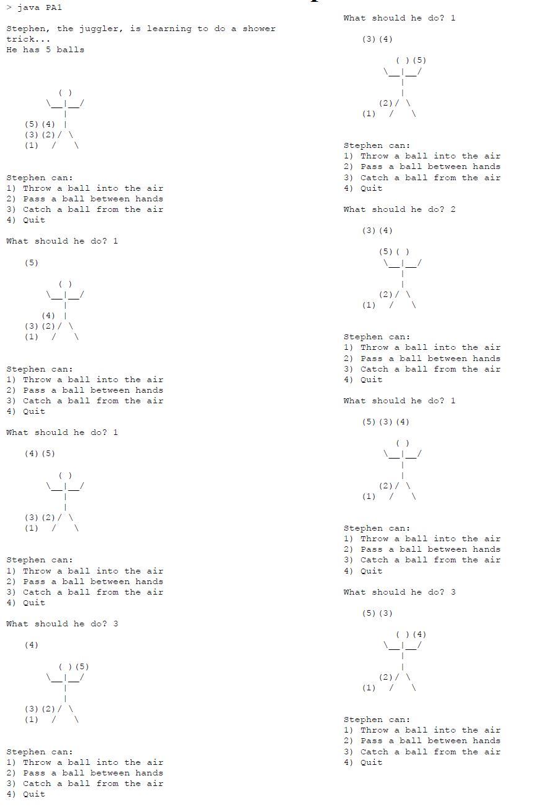
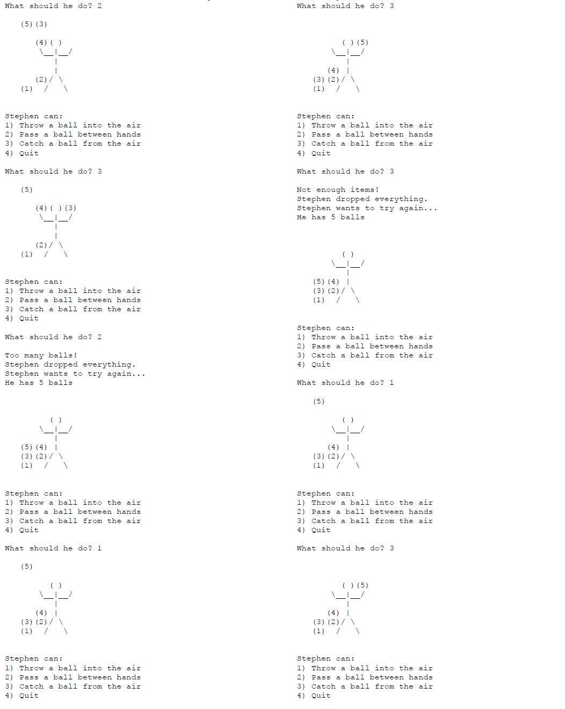
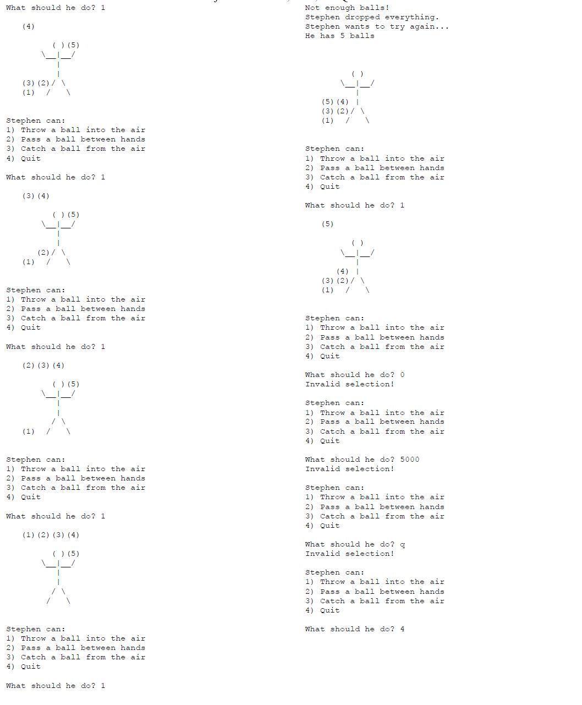

# Juggler-Game

```
You will have a juggler (Stephen) who is using two data structures to juggle (his hands and the air).
His hands will be modeled with a simple data structure that holds a single juggling ball at a time, 
and the air will be modeled as a queue data structure which can hold a 
several items.

```
# Compile

```
You can create a folder Juggler-Game add all the souce code provided in the Juggler filer above.
Go to terminal and into the deriectory of the File created with the source code.
Compile using command javac *.java in terminal
Run using java Test in terminal.

```
# Example Run



